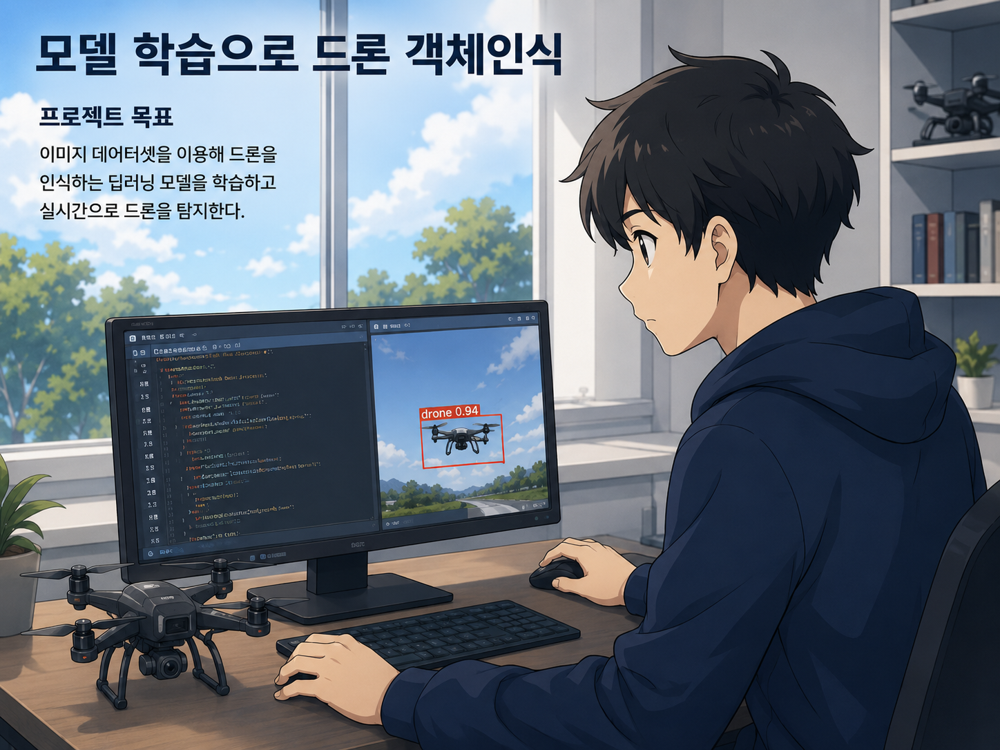

# Drone Object Detection

<p align="center">
  
</p>

**YOLO 모델 학습 기반, 온디바이스 환경 및 기업 제공 영상에 최적화된 객체 인식 프로젝트**

### 결과물

- **발표자료** — [docs/presentation.pptx](docs/presentation.pptx)
- **시연 영상** — [docs/demo.mp4](docs/demo.mp4)

## 프로젝트 목적

드론 영상에서 사람과 차량 등의 객체를 실시간으로 탐지할 수 있는 객체 인식 시스템을 구축하고, 기업에서 제공한 온디바이스 환경에 적합하도록 모델을 최적화하는 것을 목표로 한다.

재구성한 데이터셋을 기반으로 YOLO 모델을 학습하고, OpenCV를 활용하여 실시간 객체 탐지 시스템을 구현한다. 이후 기업에서 제공한 실제 드론 영상을 테스트 데이터로 활용하여 다양한 환경에서 사람과 차량 등의 객체를 효과적으로 탐지할 수 있는지 검증한다.

최종적으로 객체 탐지 정확도와 실시간 처리 성능을 종합적으로 분석하여 온디바이스 환경에서의 모델 최적화 수준을 확인하고, 개발한 객체 탐지 시스템의 실제 드론 환경 적용 가능성을 평가한다.

## 기술 스택

- **개발 언어**: Python
- **객체 탐지 모델**: YOLO (Ultralytics)
- **영상 처리**: OpenCV
- **모델 경량화/배포**: ONNX
- **학습 데이터셋**: VisDrone (오픈 데이터셋)
- **개발 도구**: Visual Studio Code
- **테스트 데이터**: 기업 제공 실제 드론 영상

### 실행 환경 구분

학습 환경(PC)과 배포 환경(Jetson)의 하드웨어·라이브러리 제약이 달라 두 환경을 분리해 구성했다.

| 구분 | 학습/개발 PC | 온디바이스 (NVIDIA Jetson) |
|---|---|---|
| OS / Python | Python 3.13.5 | Ubuntu, Python 3.8 |
| GPU | NVIDIA GPU, CUDA 12.8 | CUDA 10.2 |
| 추론 방식 | PyTorch (`.pt`) | ONNX Runtime (`.onnx`) |
| 비고 | `requirement.txt` 기준 | 구형 하드웨어로 최신 PyTorch 연산에 제약이 있어 ONNX 변환 후 런타임으로 추론 |

## 프로젝트 구조

```
detection/
├── datasets/
│   └── VisDrone/
│       ├── images/                     # train/val/test 원본 이미지
│       ├── labels/                     # 현재 사용 중인 라벨 (재구성 완료본)
│       ├── labels_orig/                # 원본 10클래스 라벨 백업
│       └── labels_person_merged_backup/ # 1차(person만 통합) 라벨 백업
├── datasets/VisDrone_person.yaml       # 9클래스(person 통합) 데이터 설정
├── datasets/VisDrone_merged.yaml       # 7클래스(person+car+tricycle 통합) 데이터 설정
├── runs/detect/                        # 학습 실험 결과 (가중치, 지표, 그래프)
├── merge_person.py                     # 1차 라벨 통합 스크립트 (person만 통합, 9클래스)
├── merge_classes.py                    # 2차 라벨 통합 스크립트 (person+car+tricycle 통합, 7클래스)
├── convert.py                          # PT -> ONNX 모델 변환
├── main.py                             # ONNX 모델 기반 실시간 추론(트래킹) — 온디바이스 최종본
├── main_track.py                       # PT 모델 기반 실시간 추론(트래킹, persist)
├── main_predict.py                     # PT 모델 기반 실시간 추론(단일 프레임 예측)
├── docs/
│   ├── presentation.pptx               # 최종 발표자료
│   ├── demo.mp4                        # 시연 영상
│   └── images/                         # README용 이미지
├── requirement.txt                     # 의존 패키지 목록
└── README.md
```

## 설치

### 개발 PC (학습 및 PC 추론)

```bash
pip install -r requirement.txt
```

CUDA 환경에 맞는 PyTorch가 필요하면 `requirement.txt` 하단 안내에 따라 별도 인덱스로 설치한다.

### 온디바이스 (NVIDIA Jetson)

Jetson은 ARM64(aarch64) 아키텍처에 구형 CUDA(10.2)를 사용하므로,
`requirement.txt`의 `onnxruntime-gpu`와 `torch`를 그대로 설치하면 안 된다.
PyPI의 일반 배포본은 x86_64 + 최신 CUDA 기준으로 빌드되어 있어,
설치가 되더라도 GPU 가속이 잡히지 않고 CPU로 fallback되어 FPS가 크게 저하된다.
에러 없이 조용히 느려지기 때문에 확인이 필요하다.

Jetson에서는 JetPack 버전에 맞는 NVIDIA 제공 wheel을 별도로 설치한다.

| 패키지 | 설치 방법 |
|---|---|
| `onnxruntime-gpu` | NVIDIA Jetson Zoo 배포 wheel |
| `torch` / `torchvision` | NVIDIA 제공 Jetson 전용 빌드 |
| `opencv-python` | **pip 설치 금지.** Jetson에 시스템 OpenCV가 이미 설치된 경우가 많으며, pip으로 덮어쓰면 CUDA 지원이 빠진 빌드로 교체되어 오히려 느려진다. `python3 -c "import cv2; print(cv2.__version__)"`로 먼저 확인할 것 |
| `ultralytics`, `onnx` | pip 설치 가능 |

설치 후 ONNX Runtime이 실제로 GPU를 사용하는지 확인한다.

```python
import onnxruntime as ort
print(ort.get_available_providers())
# CUDAExecutionProvider가 목록에 있어야 GPU 가속이 동작한다.
# CPUExecutionProvider만 나오면 wheel이 잘못 설치된 것이다.
```

## 데이터셋 준비 및 라벨 재구성

VisDrone 데이터셋은 원본 10개 클래스(`pedestrian`, `people`, `bicycle`, `car`, `van`, `truck`, `tricycle`, `awning-tricycle`, `bus`, `motor`)로 구성되어 있다. 온디바이스 환경에서의 탐지 효율을 위해 시각적으로 유사하거나 활용 목적이 겹치는 클래스를 통합해 재구성했다.

### 1차 통합 — `merge_person.py` (10 → 9클래스)

`pedestrian` + `people` → `person`으로만 통합.

```bash
python merge_person.py datasets/VisDrone
python merge_person.py datasets/VisDrone --restore   # 원복
```

### 2차 통합 — `merge_classes.py` (10 → 7클래스, 현재 사용)

1차 통합 규칙에 더해 `car`+`van` → `car`, `tricycle`+`awning-tricycle` → `tricycle`까지 통합한 최종 버전.

```
pedestrian(0) + people(1)          -> person(0)
bicycle(2)                         -> bicycle(1)
car(3) + van(4)                    -> car(2)
truck(5)                           -> truck(3)
tricycle(6) + awning-tricycle(7)   -> tricycle(4)
bus(8)                             -> bus(5)
motor(9)                           -> motor(6)
```

```bash
python merge_classes.py datasets/VisDrone
python merge_classes.py datasets/VisDrone --restore   # 원복
```

두 스크립트 모두 최초 실행 시 `labels/` -> `labels_orig/`로 자동 백업하며, 데이터셋 루트의 상위 폴더에 학습용 yaml(`VisDrone_person.yaml` / `VisDrone_merged.yaml`)을 생성한다.

> **주의**: 라벨을 다시 변환하기 전에는 반드시 원본(10클래스) 라벨 상태에서 실행해야 한다. 이미 통합된 라벨 위에 다시 돌리면 클래스 id가 잘못 매핑된다. 또한 라벨을 변경한 뒤에는 `labels/train.cache`, `labels/val.cache`를 삭제해야 학습 시 캐시된 이전 클래스 정보를 참조하지 않는다.

## 모델 학습

```bash
yolo detect train model=yolo26n.pt data=datasets/VisDrone_merged.yaml epochs=100 batch=16 imgsz=640 name=visdrone_merged_640_epoch100
```

## 모델 변환 (PT → ONNX)

```bash
python convert.py
```

`best.pt`를 입력으로 받아 `imgsz=640` 고정, FP16 변환, `dynamic=False`로 온디바이스 추론에 최적화된 `best.onnx`를 생성한다.

## 실시간 추론 실행

세 스크립트 모두 상단 상수(`model`, `video_path`)를 환경에 맞게 수정한 뒤 실행한다. 공통적으로 UI 오버레이 영역(상단/하단 일부)을 마스킹해 AI가 화면 UI를 사람/차량으로 오인식하는 것을 방지한다.

| 스크립트 | 모델 형식 | 추론 방식 |
|---|---|---|
| `main.py` | ONNX (`best.onnx`) | `model.track` (트래킹) |
| `main_track.py` | PyTorch (`.pt`) | `model.track(persist=True)` (트래킹, ID 유지) |
| `main_predict.py` | PyTorch (`.pt`) | `model.predict` (프레임 단위 탐지) |

```bash
python main.py
```

화면에는 Bounding Box, 클래스, 신뢰도와 함께 실시간 FPS가 표시된다.

## 학습 실험 결과 (정확도)

| 실험 | 모델 | 데이터(클래스 수) | Epoch | Precision | Recall | mAP50 | mAP50-95 |
|---|---|---|---|---|---|---|---|
| visdrone_640 | yolo26n | VisDrone (10) | 50 | 0.394 | 0.313 | 0.279 | 0.154 |
| visdrone_640_epoch100 | yolo26n | VisDrone (10) | 100 | 0.449 | 0.331 | 0.313 | 0.172 |
| visdrone_person_640_epoch100 | yolo26n | VisDrone_person (9) | 100 | 0.457 | 0.344 | 0.323 | 0.182 |
| visdrone_yolov5n_person_640_epoch100 | yolov5n | VisDrone_person (9) | 100 | 0.468 | 0.335 | 0.324 | 0.185 |
| **visdrone_merged_640_epoch100** | yolo26n | VisDrone_merged (7) | 100 | **0.507** | **0.370** | **0.363** | **0.198** |

클래스 통합(10 → 9 → 7)과 학습 epoch 증가에 따라 mAP50, mAP50-95, Precision, Recall이 모두 단계적으로 개선되었으며, 최종적으로 `visdrone_merged_640_epoch100` 모델의 가중치를 `best.pt` / `best.onnx`로 사용한다.

## 온디바이스 최적화 결과 (추론 속도)

PC에서 학습한 모델을 Jetson으로 그대로 포팅했을 때 심각한 병목이 발생했다.
아래 세 단계를 거쳐 초기 대비 약 148%의 프레임 향상을 달성했다.

| 단계 | 적용 내용 | FPS | 초기 대비 |
|---|---|---|---|
| 1차 포팅 | PyTorch 모델 그대로 이식 | 1.28 | 기준 |
| 2차 | ONNX 변환 + 입력 해상도/FPS 조절 | 2.84 | 약 122% 향상 |
| 3차 | 모델 아키텍처 업그레이드 (yolov5n → yolo26n) | 3.47 | 약 148% 향상 |

### 입력 데이터 최적화

원본 FHD 영상을 그대로 넣으면 연산 부하가 과도해 실시간 구동이 불가능했다.
실시간성이 유지되는 최소 수준까지 해상도와 프레임을 낮춰 부하를 경감했다.

| 구분 | 원본 영상 | 변환 영상 |
|---|---|---|
| 해상도 | 1920 × 1080 (FHD) | 960 × 540 |
| FPS | 29.97 | 20 |

### 정확도 저하 대응

최적화로 인한 탐지율 저하를 아래 두 가지로 보완했다.

- **UI 영역 마스킹** — 화면 상/하단의 고정 UI를 사람·차량으로 오인식하는 문제가 있어,
  추론 직전 해당 영역을 검게 마스킹해 오탐지를 원천 차단했다.
  단, 시각화는 마스킹되지 않은 원본 프레임 위에 그려 화면 품질을 유지한다.
- **객체 추적 전환** — `model.predict`(프레임 단위 단순 탐지)에서
  `model.track(persist=True)`로 전환해 프레임 간 연속성을 부여하고 순간적인 오탐지를 감소시켰다.

## 결과물

- 오픈 데이터셋 기반 YOLO 객체 탐지 학습 모델 (`best.pt` / `best.onnx`)
- 유사 클래스 통합 및 라벨 재구성을 적용한 학습 데이터셋 (10 → 7클래스)
- 해상도 및 FPS 조정을 적용한 드론 영상 전처리 결과
- 기업 제공 실제 드론 영상에 대한 객체 탐지 결과 영상 ([docs/demo.mp4](docs/demo.mp4))
- Bounding Box, 클래스, 신뢰도, 실시간 FPS가 표시된 객체 탐지 시스템
- 온디바이스 환경에서의 추론 속도 개선 결과 (1.28 → 3.47 FPS)

## 향후 과제

- 녹화 영상이 아닌 실시간 스트리밍 환경 구축 및 드론 제어 연동
- 한국 환경에 맞는 자체 데이터셋 구축·라벨링을 통한 도메인 정확도 향상
- C++ 기반 임베디드 연산 처리를 통한 상용화 수준의 경량화 파이프라인 구성

## 참고 자료

- [우크라전 전장서 '광섬유 드론' 공포 확산…전파 방해도 안통해 (연합뉴스, 2025.04.23)](https://www.yna.co.kr/view/AKR20250423131000009)
- [VisDrone Dataset — Ultralytics](https://docs.ultralytics.com/ko/datasets/detect/visdrone)